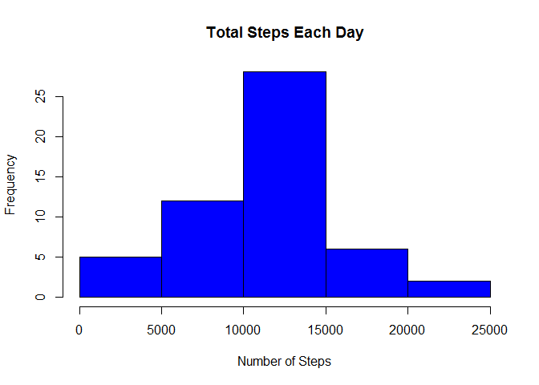
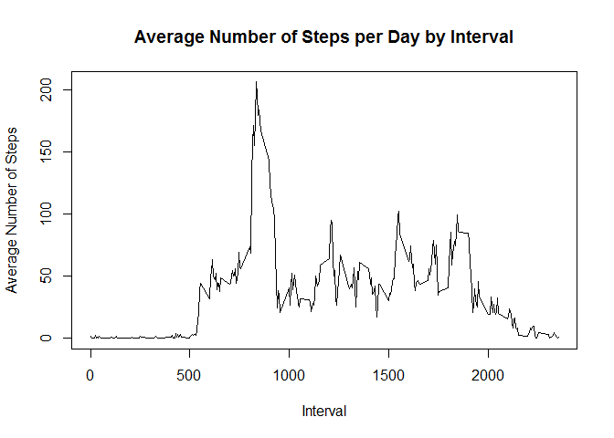
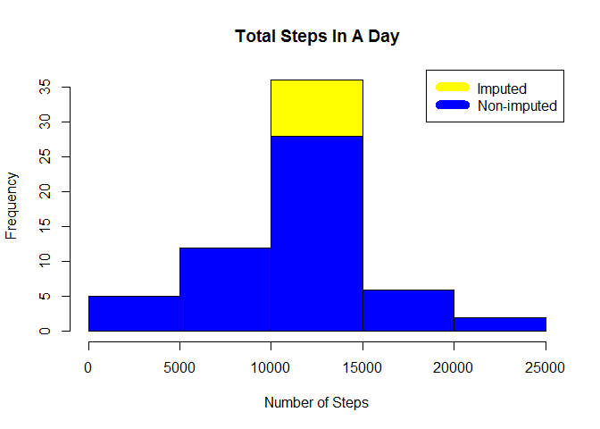
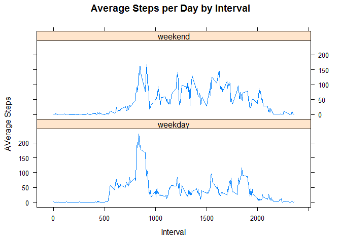

# Reproducible Research: Analyzing Activity monitoring data
## Introduction

This assignment makes use of data from a personal activity monitoring device. This device collects data at 5 minute intervals through out the day. The data consists of two months of data from an anonymous individual collected during the months of October and November, 2012 and include the number of steps taken in 5 minute intervals each day.

## Dataset

The data for this assignment can be downloaded from the course web site:
* Dataset: [Activity monitoring data](https://d396qusza40orc.cloudfront.net/repdata%2Fdata%2Factivity.zip) [52K]

The variables included in this dataset are:

* **steps**: Number of steps taking in a 5-minute interval (missing values are coded as `NA`)

* **date**: The date on which the measurement was taken in YYYY-MM-DD format

* **interval**: Identifier for the 5-minute interval in which measurement was taken

The dataset is stored in a comma-separated-value (CSV) file and there are a total of 17,568 observations in this dataset.
    
## Loading and preprocessing the data

Check if file exists else download the file and extract in the folder

```r
curr_wd <- getwd()

fileurl<-"https://d396qusza40orc.cloudfront.net/repdata%2Fdata%2Factivity.zip"

if (!file.exists('./activity.zip')){
  download.file(fileurl,'./activity.zip', mode = 'wb')
  unzip("activity.zip", exdir = '.')
}

activity_data <- read.csv('./activity.csv')
```
#### Summary of data looks like as below:


```r
summary(activity_data)
```

```
##      steps                date          interval     
##  Min.   :  0.00   2012-10-01:  288   Min.   :   0.0  
##  1st Qu.:  0.00   2012-10-02:  288   1st Qu.: 588.8  
##  Median :  0.00   2012-10-03:  288   Median :1177.5  
##  Mean   : 37.38   2012-10-04:  288   Mean   :1177.5  
##  3rd Qu.: 12.00   2012-10-05:  288   3rd Qu.:1766.2  
##  Max.   :806.00   2012-10-06:  288   Max.   :2355.0  
##  NA's   :2304     (Other)   :15840
```

```r
str(activity_data)
```

```
## 'data.frame':	17568 obs. of  3 variables:
##  $ steps   : int  NA NA NA NA NA NA NA NA NA NA ...
##  $ date    : Factor w/ 61 levels "2012-10-01","2012-10-02",..: 1 1 1 1 1 1 1 1 1 1 ...
##  $ interval: int  0 5 10 15 20 25 30 35 40 45 ...
```

## What is mean total number of steps taken per day?
Aggregate Steps by day, generate histogram of the total number of steps taken each day and calculate Mean and Median

```r
daily_steps <- aggregate(steps ~ date, activity_data, sum)

hist(daily_steps$steps, main = paste("Total Steps Each Day"), col="blue", xlab="Number of Steps")
```

<!-- -->

```r
steps_mean <- mean(daily_steps$steps)

steps_median <- median(daily_steps$steps)
```

Mean total number of steps taken per day: 1.0766189\times 10^{4}

Median total number of steps taken per day: 10765

## What is the average daily activity pattern?
To understand the average daily activity pattern, we need to:
* Calculate average steps for each interval for all days
* Plot the average number steps for each day by Interval
* Find interval with most average steps


```r
avg_step_intvl <- aggregate(steps ~ interval, activity_data, mean)

plot(avg_step_intvl$interval,avg_step_intvl$steps, type="l", xlab="Interval", ylab="Average Number of Steps", main="Average Number of Steps per Day by Interval")
```

<!-- -->

```r
max_interval <- avg_step_intvl[which.max(avg_step_intvl$steps),1]
```
5-minute interval, on average across all the days in the dataset, that contains the maximum number of steps is: 835

## Imputing missing values
There are a number of days/intervals where there are missing values in the dataset (coded as NA). The presence of missing days may introduce bias into some calculations or summaries of the data.


```r
total_NA <- sum(!complete.cases(activity_data))
```

The total number of rows with NAs: 2304

Imputing missing values using mean for each day and create a new dataset that is equal to the original dataset however, with the missing data filled in:


```r
imputed_activity_data <- transform(activity_data, steps = ifelse(is.na(activity_data$steps), avg_step_intvl$steps[match(activity_data$interval, avg_step_intvl$interval)], activity_data$steps))
```
Make a histogram of the total number of steps taken each day and Calculate and report the mean and median total number of steps taken per day.


```r
daily_steps_imp <- aggregate(steps ~ date, imputed_activity_data, sum)

hist(daily_steps_imp$steps, main = paste("Total Steps In A Day"), col="yellow", xlab="Number of Steps")

#Create Histogram to show difference. 
hist(daily_steps$steps, main = paste("Total Steps In A Day"), col="blue", xlab="Number of Steps", add=T)
legend("topright", c("Imputed", "Non-imputed"), col=c("yellow", "blue"), lwd=10)
```

<!-- -->
Calculate new mean and median for imputed data.


```r
steps_mean_imp <- mean(daily_steps_imp$steps)

steps_median_imp <- median(daily_steps_imp$steps)
```

Mean total number of steps taken per day (imputed): 1.0766189\times 10^{4}

Median total number of steps taken per day (imputed):1.0766189\times 10^{4}

Calculate difference between imputed and non-imputed mean steps per day.


```r
mean_diff <- steps_mean_imp - steps_mean

median_diff <- steps_median_imp - steps_median
```
Mean difference: 0

Median difference: 1.1886792

Based on the above observations, it seems the there is a marginal impact on median due to imputed data where as there is practically no impact on the mean.

## Are there differences in activity patterns between weekdays and weekends?

A comparative analysis of Weekdays vs Weekend activity is generated for average number of steps taken. 


```r
library(lattice)

data_actv_fact <- imputed_activity_data
data_actv_fact$daytype[as.POSIXlt(data_actv_fact$date)$wday %in% c(0,6)] <- "weekend"
data_actv_fact$daytype[as.POSIXlt(data_actv_fact$date)$wday %in% c(1:5)] <- "weekday"

steps_interval_imp <- aggregate(steps ~ interval + daytype, data_actv_fact, mean)

xyplot(steps_interval_imp$steps ~ steps_interval_imp$interval|steps_interval_imp$daytype, main="Average Steps per Day by Interval",xlab="Interval", ylab="AVerage Steps",layout = c(1,2), type="l")
```

<!-- -->

On weekdays, spike shows much higher activitiy during the initial part of the day and much more lower during the rest of the day.On weekends, activities are much more frequent.


  
